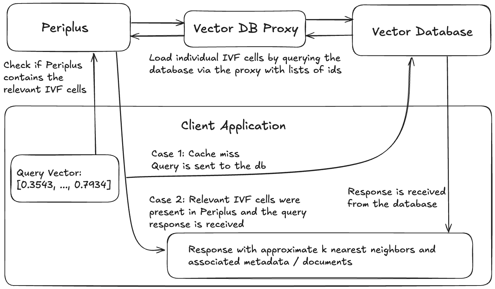

# Periplus

[](https://github.com/QDL123/Periplus/actions/workflows/ci.yaml)


## ***Warning: Periplus is in Alpha***
Periplus is currently in alpha and is not production-ready. The project is under active development, and is not yet recommended for use in production systems.

## Introduction
Periplus is an open-source in-memory vector database cache built on Meta's vector similarity search library [FAISS](https://github.com/facebookresearch/faiss). The project can best be thought of as "Redis for vector databases". It's designed to store a dynamically updated subset of a large vector collection entirely in memory while serving queries without interacting with any other nodes at query time. When Periplus receives a query, it first assesses whether it has the releveant part of the index in-residence. If it does, it resolves the query with the appropriate response. If it doesn't, it returns a cache miss and leaves the querier to fetch the data from the database. Periplus is not designed to function in isolation. Instead, it is meant to form a modular and flexible caching layer for a separate vector database which forms the persistance layer. The purpose of this is to enable lower latency and easy horizontal scaling for increasing throughput. For a more detailed description of the inspiration behind Periplus and how it works you can read the announcement blog: [Introducing Periplus: A New Approach to Vector Database Caching](https://medium.com/@quintindleary/ed8fa7a0f234).

## How It Works
Periplus uses an inverted file index (IVF) as the basis for cache management. Inverted file indexes partition the vector space into contiguous cells defined by a set of centroid vectors where each cell is defined as the region which is closer to it's centroid than to any other centroid. Queries are then resolved by first computing the distances from the query vector to the set of centroids and then searching only the cells defined by the **nprobe** (search hyperparameter) closest centroids. Periplus takes advantage of this by keeping a subset of these cells in residence at any given time and only resolving queries which are relevant to that subset while rejecting the ones that aren't as cache misses. Periplus loads and evicts entire IVF cells at a time to maintain the integrity of the index and ensure equivalent recall (on cache hits) to a standard IVF index. IVF cells are loaded by querying the vector database via a proxy with a list of ids of vectors which Periplus maintains to track which vectors occupy which cells. These operations can be invoked by the user using **LOAD**, **SEARCH**, and **EVICT** commands. For details, see the [Periplus Commands](README.md#periplus-commands) section below.


## Running Periplus
Periplus can either be run as a Docker container or it can be built from source and run as an executable. No official binaries are currently available. Running Periplus as a container is the recommended approach, but both are viable options.

### Running Periplus as a container
Currently, the Docker image only supports AMD64 architectures. This constraint stems from the base image, but more architectures will be supported in the near future. There are 2 ways to run Periplus as a container: download the official Docker image from Dockerhub (recommended) or build the image yourself. The first step in either case is to install Docker if you haven't already. The instructions to do so can be found [here](https://docs.docker.com/get-docker/).

#### Using the Official image
1. Download the image by running:   `docker image pull <TODO: insert image name here>`. 
2. Run the container:       `docker run -p 3000:3000 <TODO: insert image name here>`

#### Building the image
1. Clone the repository: ```git clone https://github.com/QDL123/Periplus.git```
2. CD to the repository root: ```cd <path-to-periplus-repo>/Periplus```
3. Build the image: `docker build -t periplus-image .`
4. Run the container: `docker run -p 3000:3000 periplus-image .`


 ### Building Periplus from source
 Periplus uses CMake for it's build system. It expects all dependencies to have pre-compiled binaries installed via Homebrew. Homebrew is supported by MacOS, Ubuntu, and WSL if you're on Windows. Periplus has been built on MacOS/ARM64 and Ubuntu/AMD64. All other operating system and architecture combinations are untested. To build Periplus from source, follow the following steps:

 1. Install Homebrew: Visit the official homebrew site [here](https://brew.sh/) for installation instructions.
 2. Install Periplus's dependencies. To install them all at once, run: `brew install faiss curl cpr rapidjson libomp catch2 cmake`
 3. Clone the repository: ```git clone https://github.com/QDL123/Periplus.git```
 4. CD to the repository root: ```cd <path-to-periplus-repo>/Periplus```
 4. Generate the Makefile: `cmake -S . -B build`
 5. Compile the executable: `cmake --build build`
 6. Run Periplus (listening on port 3000): `./build/periplus -p 3000`


## Using Periplus
Any system using Periplus will consist of 4 components: the vector database, a database proxy which allows Periplus to load data from the database, a Periplus instance, and a client application.

 

Example architecture of an application using Periplus.

### The Vector Database
Any vector database that allows for looking up data by a unique identifier (virtually all of them) will work. Periplus is designed to be most beneficial when working with really large vector collectons (billion-scale) where the index has to live on the file system as opposed to RAM, although that's not a requirement.

### The Vector Database Proxy
The vector database proxy's purpose is to provide a consistent interface for Periplus to interact with the vector database through. The proxy must implement a REST interface which accepts POST requests of the following form:

URL: This is flexible and can be specified by the Periplus client.

Headers:
`"Content-Type": "application/json`

Body:
```JSON
{
    "ids": [
        "<String>",
        ...
    ]
}
```

Response:
```JSON
{
    "results": [
        {
            "id": "<String>",
            "embedding": ["<Floating Point Number>", ...],
            "document": "<String>",
            "metdata": "<String>"
        },
        ...
    ]
}
```

To make implementing this endpoint easier, you can you use the periplus-proxy python package which uses FastAPI to set everything up. All the user has to do is implement the following function and pass it as an argument:

`async def fetch_ids(request: Query) -> QueryResult`

For details on how to do this, you can check out the periplus-proxy package [README.md](proxies/python/README.md).

### Periplus
Follow the instructions [above](README.md#running-periplus) to start up a Periplus instance.

### Client Application
To interact with your Periplus instance, use the Periplus client library. Currently only python is supported. For details on the client library, you can view it's README.md [here](clients/python/README.md).

#### Periplus Commands
1. **INITIALIZE**: This is the setup command for Periplus. It must be called before any other command and any subsequent **INITIALIZE** calls will wipe all the data and reset the Periplus instance. There are 2 required arguments: d (dimensionality of the vector collection), and db_url (url of the database proxy endpoint used to load data). There is also an optional options object argument with 2 available options: **nTotal** and **use_flat**. The first, **nTotal**, is an estimate of the total number of vectors in the collection. This is used to optimize the number of IVF cells to use. If not specified, Periplus will pick a middle ground which can lead to suboptimal performance. The second, **use_flat**, is a boolean which instructs Periplus to use a flat index instead of applying any product quantization (PQ). By default this value is false, in which case product quantization will be applied if the vectors are large enough and easily divisible into subvectors. If set to true, a flat IVF index will be used instead.
2. **TRAIN**: This command sets the position of the centroids in the IVF index that forms the basis of the cache. Once the centroid positions are set they cannot be reset without completely wiping the cache. It takes a list of vector embeddings as an argument which should be a representative sample of your vector collection. It's recommended to use up to 10% of your total collection, but less is okay for really large datasets where 10% will overwhelm the Periplus instance.
3. **ADD**: This command makes Periplus aware of the data without actually populating the cache, so that it can later be loaded from the database. Any vector that Periplus should be able to load first needs to be registered via the ADD command. The command takes two arguments ids and embeddings which are lists of equal lengths with vector ids and corresponding vector embedding.
4. **LOAD**: This command instructs Periplus to load IVF cell(s) (see [How it works](README.md#how-it-works) for details) from the database. It has one required argument, a vector telling it what cells to target, and an optional options object with one available option  **nLoad** which tells it how many cells to load. Periplus will load the nearest nLoad cells to the vector from the database (nLoad defaults to 1 if not specified). This guarantees that a subsequent **SEARCH** command with the same vector will yield a cache hit (assuming the cell has not been evicted beforehand and the nLoad argument matches the nProbe argument given in the search).
5. **SEARCH**: This command runs a set of queries against the data stored in Periplus. It takes 2 required arguments: **k** which specifies the number of nearest neighbors to return, and **xq** which is a list of query vectors. It optionally takes an options object with two available options: **nprobe** and **require_all**. The first specifies how many IVF cells to search. Larger values result in increased latency but also increased recall (and a lower cache hit rate when **require_all** is used). The default value is 1 if unspecified. The second option **require_all** is a boolean that dictates the cache hit/miss behavior. If set to true, all **nprobe** nearest cells must be in-residence for the query to be a cache hit. If false, only the nearest IVF cell must be in-residence for the query to be a cache hit, and Periplus will search which ever IVF cells are in-residence up to the **nprobe** closest IVF cell. The default value is true. The **SEARCH** command returns a list of lists of Document tuples where each list corresponds to the k results for the corresponding query vector provided at that index. Cache misses will have a list of length 0. In rare cases, if the length is > 0 and <  k that indicates that the total number of vectors in the nearest **nprobe** cells is < k. Each Document tuple has 4 fields: id, embedding, metadata, and document which will correspond the values provided by the database proxy when the data was loaded.
6. **EVICT**: This command works exactly the same as **LOAD** except it evicts IVF cell(s) if they are present from Periplus instead of loading them. It has one required arugment, a vector telling it what cells to target, and an optional options object with one available option **nEvict** whch tells it how many cells to evict. Periplus will evict the cells corresponding to the nearest **nEvict** centroids to the vector from Periplus (nEvict defaults to 1 it not specified). 

#### Example
```python
from periplus_client import Periplus

# host, port
client = Periplus("localhost", 13)

# vector dimensionality, database proxy url, options: (nTotal)
await client.initialize(d=d, db_url=url, options={ "nTotal": 50000 })

training_data = [[0.43456, ..., 0.38759], ...]
await client.train(training_data)

ids = ["0", ..., "n"]
embeddings = [[0.43456, ..., 0.38759], ...]
await client.add(ids=ids, embeddings=embeddings)

load_options = { "nLoad": 2 }
# query_vector, optional: options object
await client.load([embeddings[0]] load_options)

# k, query_vector
response = await client.search(5, [embeddings[0]])
print(response)
'''
[ // Results for each of the n query vectors in xq
    [ // K nearest neighbors to this corresponding index in the xq list
        (
            id="n",
            embedding=[0.43456, ..., 0.38759]
            metadata={},
            document=""
        ),
        ...
    ],
    ...
]
'''

# query_vector
await client.evict(embeddings[0])
```

## Benchmarking
### Coming Soon!

## Contributing
We welcome contributions to the Periplus! To contribute:

- Fork the repository.
- Create a new branch: git checkout -b feature/your-feature-name.
- Make your changes.
- Commit your changes: git commit -m 'Add some feature'.
- Push to the branch: git push origin feature/your-feature-name.
- Open a pull request.

## License
This project is licensed under the MIT License - see the LICENSE file for details.